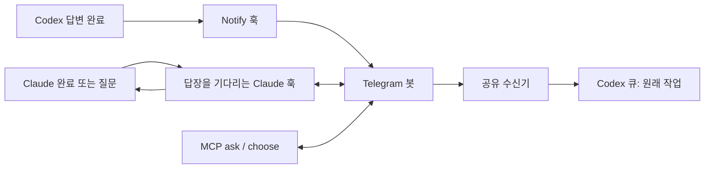

# EchoLoop

**한국어** · [English](README.md)

AI 작업 결과를 텔레그램으로 받고, 알림에 답장해서 같은 세션의 작업을 이어가세요.

> [!IMPORTANT]
> **결과가 도착하면 반드시 그 텔레그램 말풍선의 ‘답장’ 기능으로 다음 작업을 지시하세요.**
> 답장한 원본 알림을 기준으로 작업할 AI 세션을 찾습니다. 여러 세션을 사용한다면 원하는 세션의 알림에 답장하세요. 일반 메시지만 보내면 대상 세션을 지정할 수 없습니다.


[](LICENSE)

봇 하나로 같은 컴퓨터의 여러 AI 세션을 연결합니다. 답장한 원본 알림을 기준으로 세션을 구분하며, 공개 서버나 인바운드 포트 없이 로컬에서 실행합니다.

## 설치

Node.js 20 이상, npm, PATH에 등록된 Codex 또는 Claude Code가 필요합니다. Windows·macOS·Linux에서 같은 명령어를 사용합니다.

저장소를 내려받은 폴더에서 실행하세요.

```sh
npm ci
npm pack
npm install -g ./echoloop-mcp-0.1.0.tgz
```

`npm pack`이 TypeScript를 빌드하고 설치 패키지를 만듭니다. 전역 설치는 한 번만 하면 됩니다. 개발 중에는 `npm run build` 후 `npm link`로 연결할 수도 있습니다.

npm 레지스트리에 배포한 이후에는 `npm install -g echoloop-mcp`로 설치할 수 있습니다. 이 저장소의 구현 완료가 레지스트리 배포 완료를 의미하지는 않습니다.

설치 과정에서는 짧은 설정 안내만 출력합니다. 토큰 입력이나 클라이언트 설정 변경은 하지 않습니다. npm이 설치 로그를 숨겨 안내가 보이지 않아도 `echoloop setup`을 실행하면 됩니다. Windows PowerShell에서 `.ps1` 실행이 차단되면 `npm.cmd`, `echoloop.cmd`로 실행하세요.

## 최초 설정

알림을 사용할 프로젝트 폴더에서 실행합니다.

```sh
cd "프로젝트 경로"
echoloop setup
```

1. **English / 한국어** 중 CLI 출력 언어를 선택합니다. 선택한 언어는 저장됩니다.
2. [BotFather](https://t.me/BotFather)를 열고 `/newbot`을 보냅니다. 표시 이름과 `bot`으로 끝나는 고유 사용자명을 정합니다.
3. 발급받은 API 토큰을 터미널에 붙여 넣습니다. 입력 내용은 숨겨지며 Telegram API로 토큰을 검증합니다.
4. 출력된 봇 링크를 열고 **2분 안에 시작(Start)**을 누릅니다. 개인 챗 ID를 자동으로 찾아 저장하므로 직접 조회할 필요가 없습니다.
5. 감지한 클라이언트의 연동을 설치하고 현재 프로젝트를 ON으로 설정한 뒤 명령어 도움말을 출력합니다. 연결한 클라이언트를 한 번 재시작하세요.

현재 초기 설정은 **텔레그램만 지원**합니다. 디스코드 연결과 플랫폼 선택 메뉴는 [백로그](BACKLOG.md)에 남겨 두었습니다.

다시 setup을 실행하면 저장된 언어와 인증정보를 재사용합니다. 지원 클라이언트를 새로 설치하거나 패키지 위치가 바뀌면 setup을 다시 실행하세요. 최초 설정에서 기존 `TELEGRAM_BOT_TOKEN`, `TELEGRAM_CHAT_ID` 환경변수를 가져올 수도 있습니다. CLI 연동에서는 저장된 인증정보가 우선합니다.

## 명령어와 사용 방법

다음은 터미널 명령어입니다. AI에게 질문할 때마다 입력할 필요가 없습니다.

| 명령어 | 설명 |
|---|---|
| `echoloop setup` | 텔레그램 연결, 클라이언트 훅 설치, 현재 프로젝트 ON |
| `echoloop on [경로]` | 해당 프로젝트 알림 켜기; 경로 생략 시 현재 폴더 |
| `echoloop off [경로]` | 해당 프로젝트 알림 끄기 |
| `echoloop status [경로]` | 연결 상태 및 프로젝트 설정 확인; 토큰은 표시하지 않음 |
| `echoloop language en` | CLI 출력 언어를 영어로 변경 |
| `echoloop language ko` | CLI 출력 언어를 한국어로 변경 |
| `echoloop help` | 도움말; `--help`, `-h`도 지원 |

다른 프로젝트에는 파일을 복사할 필요 없이 다음과 같이 사용합니다.

```sh
cd "다른 프로젝트 경로"
echoloop on
echoloop status
# Codex 또는 Claude Code에서 평소처럼 작업합니다.
echoloop off
```

하위 폴더는 가장 가까운 상위 폴더의 설정을 따릅니다. 하위 폴더를 명시적으로 OFF로 설정하면 상위 폴더가 ON이어도 꺼집니다. 설정이 없는 프로젝트는 기본 OFF입니다. ON/OFF는 다음 훅 실행부터 적용되며, 이미 답장을 기다리는 질문을 취소하지는 않습니다.

### 중요: 알림 말풍선에 답장해서 다음 작업 지시하기

1. 작업할 세션의 텔레그램 결과 알림을 찾습니다.
2. **그 말풍선을 길게 누르고 ‘답장’을 선택합니다.**
3. 다음 작업 지시를 입력하고 전송합니다. 예: `테스트도 실행하고 결과 알려줘`.

**답장한 알림에 연결된 동일한 AI 세션으로 지시가 전달됩니다.** `/echoloop` 같은 접두어는 필요 없습니다. 여러 세션의 알림이 섞여 있어도 원본 말풍선으로 구분하므로, 반드시 원하는 알림에 답장하세요.

선택 질문에는 번호로 답장하세요. 복수 선택은 쉼표로 구분하며 자유로운 설명도 가능합니다. 답장이 없거나 시간이 초과됐다고 임의로 동의한 것으로 처리하지 않습니다.

## 클라이언트 지원 범위

| 동작 | Codex | Claude Code |
|---|---|---|
| 답변 완료 후 자동 알림 | Notify 훅 | Stop 훅 |
| 텔레그램 답장으로 후속 지시 | 원래 작업의 큐에 전달 | 실행 중인 동일한 대화형 세션을 깨움 |
| 사용자 선택 질문 | MCP `choose` / `ask` | `AskUserQuestion` 훅 |
| 클라이언트 자체 권한 승인 | 로컬에서 처리 | PermissionRequest 훅; 명시적 허용 필요 |

Codex는 `codex queue` 지원이 필요하며 setup에서 확인합니다. MCP 지침으로 원격 질문을 요청하지만 모든 클라이언트 자체 대화창을 가로채지는 않습니다. Claude Code는 실행 파일과 인수를 분리하는 훅 및 `asyncRewake` 지원이 필요합니다. 대화형 세션을 열어 두세요. 비대화형 `claude -p`는 완료 알림에 답장해 작업을 이어가는 방식의 지원 대상이 아닙니다. 완료 알림의 답장은 약 24시간, 선택·권한 질문은 최대 9분 동안 기다립니다. 선택·권한 질문이 만료되면 로컬 상호작용으로 돌아갑니다.

컴퓨터를 켜 두고 인터넷 연결을 유지해야 합니다. 부팅 시 자동 실행되는 OS 서비스는 설치하지 않습니다. 하나의 봇은 같은 PC·같은 OS 사용자에서 사용하세요. 다른 PC나 별도 봇 프로그램이 같은 토큰을 폴링하면 충돌할 수 있습니다. 기존 Telegram webhook이 있으면 연결 전에 해제해야 합니다. 현재 텍스트 답장을 처리하며, Telegram 발신 메시지는 4,096자를 넘으면 잘립니다.

## 프로세스 구조



파일 잠금으로 로컬 프로세스 사이의 Telegram 수신 상태를 공유하고 원본 메시지 ID로 대상 세션을 구분합니다. Codex 답장은 큐 제출에 성공할 때까지 수신함에 유지합니다. 큐 제출과 로컬 수신 확인은 별도 작업이므로 그 사이에 프로세스가 중단되면 같은 답장이 중복 전달될 수 있습니다.

## 저장 위치와 문제 해결

설정 파일은 Windows에서 `%USERPROFILE%/.echoloop/config.json`, macOS/Linux에서 `~/.echoloop/config.json`입니다. 언어, 봇 토큰, 챗 ID, 프로젝트별 ON/OFF가 저장됩니다. 인증정보는 로컬 파일에 저장하며 암호화하지 않습니다. POSIX 환경에서는 디렉터리·파일 권한을 700·600으로 생성합니다.

setup은 Codex의 `~/.codex/config.toml` 또는 `CODEX_HOME`, Claude의 `~/.claude/settings.json` 또는 `CLAUDE_CONFIG_DIR`을 사용합니다. 다른 설정을 보존하고 기존 Codex 알림 명령도 함께 호출합니다. 같은 이름이 없을 때 Codex MCP 서버도 등록합니다. 기존 사용자 지정 MCP 등록은 유지하므로 필요하면 해당 경로를 직접 수정하세요.

- **챗 ID를 찾지 못함:** 현재 setup에서 출력한 링크로 들어가 Start를 누르세요. 인사만 보내는 것으로는 연결되지 않습니다. 만료되면 setup을 다시 실행하세요.
- **알림이 오지 않음:** 실제 작업 폴더에서 `echoloop status`를 확인하고, 클라이언트가 PATH에 등록돼 있는지 확인하세요. setup 이후 클라이언트를 재시작해야 합니다.
- **지원 클라이언트를 찾지 못함:** Codex 또는 Claude Code를 설치한 후 setup을 다시 실행하세요. 이미 저장된 텔레그램 연결은 유지됩니다.
- **Codex 답장이 전달되지 않음:** `~/.echoloop/codex-replies/status.json`을 확인하세요. 최근 전송 정보는 `~/.echoloop/codex-notify/last-sent.json`에 있습니다.
- **봇을 다시 연결하려면:** 연결된 클라이언트와 수신기를 종료하고 설정 JSON의 `telegram` 항목만 제거한 뒤 setup을 다시 실행하세요. 프로젝트와 언어 설정은 유지할 수 있습니다.

## MCP 및 수동 전송 설정

| 도구 | 동작 |
|---|---|
| `remote_status()` | 현재 프로젝트 ON/OFF 조회 |
| `notify(message)` | 메시지 전송; 후속 지시를 위한 세션 연결은 없음 |
| `ask(message, timeout_seconds?)` | 답장 대기; 기본 240초 |
| `choose(questions, timeout_seconds?)` | 번호 또는 자유 답장으로 선택 수집 |

별도 MCP 클라이언트는 `echoloop-mcp`를 stdio로 실행할 수 있습니다. 채널 환경변수가 없으면 저장된 Telegram 인증정보를 읽습니다. 수동 설정에는 `TELEGRAM_BOT_TOKEN`, `TELEGRAM_CHAT_ID`, `ECHOLOOP_TIMEOUT`, `ECHOLOOP_CHANNEL`(`telegram` 또는 `discord`)을 사용합니다. 기존 Discord 전송 기능은 `DISCORD_BOT_TOKEN`과 `DISCORD_CHANNEL_ID`, 또는 발신 전용 `DISCORD_WEBHOOK_URL`을 사용합니다. Discord의 답장 기반 다중 세션 분리는 아직 지원하지 않습니다.

## 개발 및 라이선스

```sh
npm ci
npm test
npm pack --dry-run
```

테스트는 Telegram API를 모의하고 실제 자식 프로세스로 최초 연결, 설정 저장, 세션 라우팅, 동시 답장, 시간 초과, 클라이언트 훅을 검증합니다. CI는 Windows·macOS·Linux와 Node.js 20·22 조합으로 구성했습니다. 로컬 테스트 통과만으로 세 운영체제의 실제 클라이언트 연동까지 검증된 것은 아닙니다.

[Apache License 2.0](LICENSE)으로 배포합니다.
