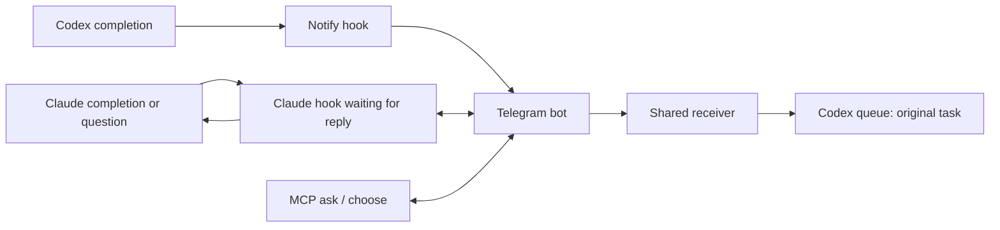

# EchoLoop

[한국어](README.ko.md) · **English**

Receive AI results on Telegram and reply to the notification to continue the same session.

> [!IMPORTANT]
> **When a result arrives, use Telegram’s Reply action on that notification to send your next instruction.**
> EchoLoop uses the original notification to identify the AI session. With multiple sessions, reply to the notification for the intended session. A standalone message does not identify a session.


[](LICENSE)

One Telegram bot can serve multiple AI sessions on the same computer. EchoLoop routes your reply using the original notification. It runs locally without a public server or inbound port.

## Install

Requires Node.js 20+, npm, and Codex or Claude Code available on PATH. Windows, macOS, and Linux use the same commands.

From a checkout of this repository:

```sh
npm ci
npm pack
npm install -g ./echoloop-mcp-0.1.0.tgz
```

`npm pack` builds the TypeScript output. Install the generated package globally once; other projects do not need a copy of the repository. For source development, use `npm run build` followed by `npm link` instead.

After a registry release is published, the equivalent installation is `npm install -g echoloop-mcp`. This repository does not itself establish that a registry release is available.

Installation prints a short setup guide. It does not prompt for credentials or change client settings. npm may hide lifecycle output; run `echoloop setup` directly if no guide appears. On Windows, use `npm.cmd` / `echoloop.cmd` if PowerShell blocks the npm-generated `.ps1` launchers.

## First setup

Run from the project you want to enable:

```sh
cd "path/to/your-project"
echoloop setup
```

1. Choose **English** or **한국어**. EchoLoop remembers the CLI language.
2. Open [BotFather](https://t.me/BotFather), send `/newbot`, and choose a display name and a unique username ending in `bot`.
3. Paste the API token at the hidden-input prompt. EchoLoop checks it with Telegram.
4. Open the generated bot link and press **Start** within two minutes. EchoLoop discovers and saves your private chat ID; you do not need to look it up.
5. EchoLoop installs integrations for detected clients, turns notifications ON for the current project, and displays command help. Restart those clients once.

Setup currently supports **Telegram only**. Discord onboarding and platform selection are in the [backlog](BACKLOG.md).

Existing credentials and language are reused on subsequent setup runs. Run setup again after installing another supported client or moving the package. Environment variables `TELEGRAM_BOT_TOKEN` and `TELEGRAM_CHAT_ID` can migrate an existing configuration on the first setup; saved credentials take precedence for CLI integrations.

## Commands and everyday use

These are terminal commands, not messages you must prepend to every AI request.

| Command | Action |
|---|---|
| `echoloop setup` | Connect Telegram and install client hooks; enable this project |
| `echoloop on [path]` | Enable a project; default is the current folder |
| `echoloop off [path]` | Disable a project |
| `echoloop status [path]` | Show Telegram connection and project settings without displaying the token |
| `echoloop language en` | Switch CLI output to English |
| `echoloop language ko` | Switch CLI output to Korean |
| `echoloop help` | Show help; also `--help` or `-h` |

Use it in another project without copying any files:

```sh
cd "path/to/another-project"
echoloop on
echoloop status
# Work normally in Codex or Claude Code.
echoloop off
```

Subfolders inherit the nearest configured parent. An explicit OFF on a subfolder overrides its parent's ON. Projects without a matching setting are OFF. ON/OFF applies to subsequent hook invocations; it does not cancel a question already waiting for a reply.

### Important: reply to the notification to continue working

1. Find the Telegram result notification for the session you want to continue.
2. **Press and hold that message, then select Reply.**
3. Type and send your next instruction, such as `Run the tests too and report the results`.

**Your instruction goes to the same AI session linked to that notification.** No `/echoloop` prefix is needed. Even when notifications from several sessions share one chat, the original message identifies the destination, so always reply to the intended notification.

For a selection question, reply with an option number, comma-separated numbers for multiple choices, or a free-text instruction. An unanswered or expired question never counts as approval.

## Client support and limits

| Behavior | Codex | Claude Code |
|---|---|---|
| Automatic completion notification | Notify hook | Stop hook |
| Continue from a Telegram reply | Queues an instruction to the original task | Wakes the same active interactive session |
| Ask the user to choose | MCP `choose` / `ask` | `AskUserQuestion` hook |
| Native permission prompt | Remains local | PermissionRequest hook; explicit allow required |

Codex must support `codex queue`; setup checks availability. Codex's MCP instructions request remote questions when enabled, but do not intercept every native client dialog. Claude Code must support exec-form hooks and `asyncRewake`. Keep its interactive session open; noninteractive `claude -p` is not supported for this completion/reply loop. Completion replies wait up to about 24 hours; selection and permission hooks wait up to nine minutes, then fall back to local interaction.

Keep the computer awake and connected. EchoLoop does not install an OS boot service. Use one computer and one OS user per bot; another bot program or computer polling the same token can conflict. An existing Telegram webhook must be removed before pairing. Text replies are supported; Telegram messages longer than 4,096 characters are truncated.

## Process structure



Telegram polling state is shared across local processes using a file lock. Original message IDs select the destination session. Codex replies stay in a persistent inbox until queue submission succeeds. Queue submission and local acknowledgement are separate operations, so a crash between them can cause duplicate delivery.

## Settings and troubleshooting

Settings are stored in the OS user's home directory: `%USERPROFILE%/.echoloop/config.json` on Windows, `~/.echoloop/config.json` on macOS/Linux. This includes the language, bot token, chat ID, and project ON/OFF map. Credentials are stored locally, not encrypted. POSIX installations create the settings directory/file with permissions 700/600.

Setup updates Codex's `~/.codex/config.toml` (or `CODEX_HOME`) and Claude's `~/.claude/settings.json` (or `CLAUDE_CONFIG_DIR`). It preserves other settings, chains the previous Codex notify command, and registers EchoLoop's Codex MCP server if that name is unused. Existing custom MCP registrations are retained; adjust their paths yourself if necessary.

- **No chat ID:** open the link from the current setup run and press Start, rather than sending a greeting. After timeout, rerun setup.
- **No notification:** check `echoloop status` in the actual project folder, client availability on PATH, and restart the client after setup.
- **No supported client found:** install Codex or Claude Code and rerun setup; the saved Telegram pairing is retained.
- **Codex reply not delivered:** inspect `~/.echoloop/codex-replies/status.json`; recent send metadata is in `~/.echoloop/codex-notify/last-sent.json`.
- **Reconfigure the bot:** stop connected clients/receivers, remove only the `telegram` entry from the settings JSON, then rerun setup. Keep project and language settings.

## MCP and manual transports

| Tool | Purpose |
|---|---|
| `remote_status()` | Check whether the current project is enabled |
| `notify(message)` | Send a message; does not attach a continuation session |
| `ask(message, timeout_seconds?)` | Wait for a reply; default 240 seconds |
| `choose(questions, timeout_seconds?)` | Collect numbered or free-text answers |

Standalone MCP clients can launch `echoloop-mcp` over stdio. It reads saved Telegram credentials when channel environment variables are absent. Manual configuration supports `TELEGRAM_BOT_TOKEN`, `TELEGRAM_CHAT_ID`, `ECHOLOOP_TIMEOUT`, and `ECHOLOOP_CHANNEL` (`telegram` or `discord`). Existing Discord transports use `DISCORD_BOT_TOKEN` plus `DISCORD_CHANNEL_ID`, or `DISCORD_WEBHOOK_URL` for sending only. Discord does not yet route replies to multiple sessions.

## Development and license

```sh
npm ci
npm test
npm pack --dry-run
```

Tests mock Telegram and launch real child processes to check pairing, settings, session routing, concurrent replies, timeouts, and client hooks. CI is configured for Windows/macOS/Linux with Node.js 20 and 22. A passing local test run does not establish live client compatibility on all three systems.

Released under [Apache License 2.0](LICENSE).
