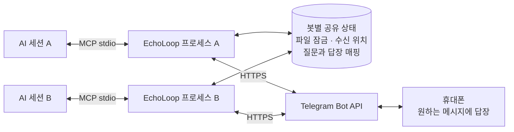
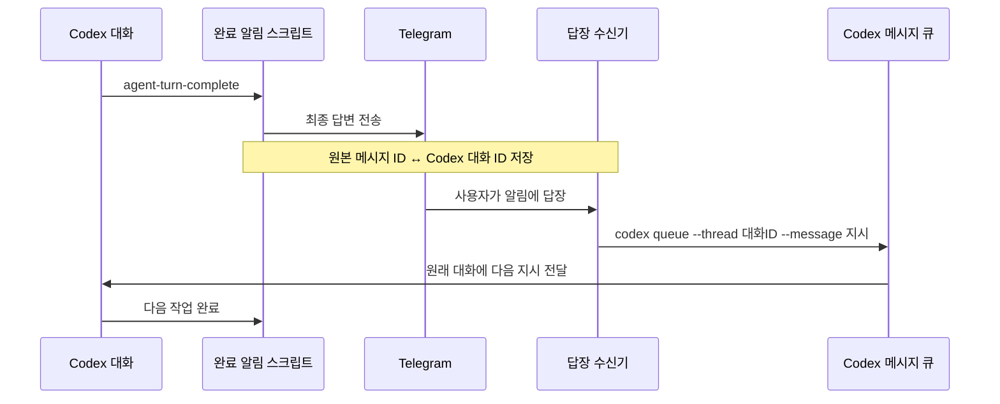

# EchoLoopMCP

**AI의 작업 결과를 휴대폰으로 받고, 메시지에 답장해서 다음 작업을 이어가세요.**

[](LICENSE)


EchoLoop는 Telegram·Discord와 AI 세션을 연결하는 로컬 MCP 서버입니다. Telegram에서는 봇 토큰 하나를 여러 세션이 공유하고, **답장한 원본 메시지**를 기준으로 지시를 전달합니다. Codex 완료 알림 연결을 사용하면 작업이 끝난 뒤에도 Telegram 답장으로 같은 대화를 계속할 수 있습니다.

공개 서버나 인바운드 포트 없이 로컬 프로세스가 메시지를 수신합니다. PC와 필요한 AI 클라이언트는 켜져 있어야 하며, AI 서비스 이용 비용은 별도입니다.

[빠른 시작](#빠른-시작) · [프로세스 구조](#프로세스-구조) · [Codex 연결](#codex-연결) · [테스트](#테스트) · [라이선스](#라이선스)

## 지원 기능

| 연결 | 알림 보내기 | 질문 후 답장 대기 | 답장으로 다중 세션 구분 | Codex 완료 알림 → 후속 지시 |
|---|:---:|:---:|:---:|:---:|
| Telegram 봇 | ✓ | ✓ | ✓ | ✓, 별도 연결 설정 |
| Discord 봇 | ✓ | ✓ | 미지원 | 미지원 |
| Discord 웹훅 | ✓ | — | — | — |

| MCP 도구 | 동작 |
|---|---|
| `notify(message)` | 메시지를 보내고 즉시 반환합니다. 후속 답장을 기다리지 않습니다. |
| `ask(message, timeout_seconds?)` | 질문을 보내고 답장을 기다립니다. 답장 텍스트 또는 시간 초과 안내를 반환합니다. |

`ask`는 기본 240초 동안 대기합니다. 클라이언트가 progress token을 제공하면 20초마다 진행 알림을 전송합니다. Telegram의 `ask`에는 질문 말풍선의 **답장** 기능을 사용하세요. 일반 텍스트와 다른 질문에 대한 답장은 해당 요청을 완료하지 않습니다.

## 빠른 시작

### 1. 설치

Node.js 20.6 이상을 권장합니다. 아래 설정 예제는 Node의 `--env-file` 옵션을 사용합니다.

```bash
npm ci
npm run build
```

`.env.example`을 `.env`로 복사하고 사용할 채널의 값을 입력합니다. `.env`는 Git에서 제외됩니다.

### 2. Telegram 봇 연결

1. [공식 BotFather](https://t.me/BotFather)에 `/newbot`을 보내 봇 토큰을 발급받습니다.
2. **새로 만든 봇**의 대화방을 열고 `/start`를 보냅니다.
3. 수신 프로세스를 실행하기 전에 아래 API를 조회하고 `result[].message.chat.id`를 확인합니다.

```text
https://api.telegram.org/bot<YOUR_BOT_TOKEN>/getUpdates
```

`.env`에 설정합니다.

```dotenv
TELEGRAM_BOT_TOKEN=YOUR_BOT_TOKEN
TELEGRAM_CHAT_ID=YOUR_CHAT_ID
ECHOLOOP_CHANNEL=telegram
```

토큰은 비밀번호처럼 보관하세요. 개인 대화방을 사용하면 해당 대화에서 보낸 지시만 받도록 범위를 제한할 수 있습니다. 그룹 채팅에는 별도의 사용자별 권한 검사가 구현되어 있지 않습니다.

### 3. MCP 클라이언트에 등록

아래 `/absolute/path/EchoLoopMCP`를 실제 프로젝트 경로로 바꿉니다. Windows에서는 `C:/projects/EchoLoopMCP`처럼 슬래시를 사용할 수 있습니다.

**Codex — 프로젝트의 `.codex/config.toml`**

```toml
[mcp_servers.echoloop]
command = "node"
args = ["--env-file=/absolute/path/EchoLoopMCP/.env", "/absolute/path/EchoLoopMCP/dist/index.js"]
tool_timeout_sec = 300
```

**Claude Code — MCP 등록**

```bash
claude mcp add echoloop -- node --env-file=/absolute/path/EchoLoopMCP/.env /absolute/path/EchoLoopMCP/dist/index.js
```

저장소의 `.mcp.json`은 셸 환경변수를 전달하는 방식입니다. 이 방식을 사용할 때는 클라이언트를 시작하기 전에 환경변수를 설정해야 하며, `.env`가 자동으로 로드되지는 않습니다.

설정 후 MCP 연결을 다시 시작합니다. 긴 `ask`를 사용할 경우 클라이언트의 도구 실행 제한도 충분히 늘려주세요.

## 프로세스 구조

### MCP 질문과 답장

AI 세션마다 MCP 프로세스가 생겨도 Telegram의 수신 위치는 봇별로 공유합니다.



1. `ask`가 질문을 전송하고 `채팅 ID + 메시지 ID`를 저장합니다.
2. 파일 잠금을 획득한 프로세스 하나가 `getUpdates`를 호출합니다.
3. 받은 답장을 원본 메시지 ID에 따라 각 대기 요청 또는 Codex 수신함에 저장합니다.
4. 답장과 수신 위치를 디스크에 함께 저장한 뒤 잠금을 해제합니다.
5. 각 프로세스는 자신의 답장만 읽어 원래 AI 세션에 반환합니다.

공유 상태는 `~/.echoloop/telegram/<봇 토큰의 SHA-256 해시>/state.json`에 저장됩니다. 토큰 원문은 상태 파일의 경로나 내용에 넣지 않습니다. 다만 대기 중인 답장 본문과 세션 매핑은 로컬 상태에 저장됩니다.

### Codex 완료 알림과 후속 지시

`ask`의 제한 시간과 별개로, 완료된 작업의 알림에 답장해서 같은 대화를 이어가는 선택 기능입니다.



| 프로세스 / 파일 | 역할 |
|---|---|
| `src/index.ts` | MCP 도구 등록, 채널 선택, 대기 중 progress 알림 |
| `src/channels/telegram.ts` | Telegram 송수신, 프로세스 간 잠금, 답장과 대화 매핑, 수신함 |
| `src/channels/discord.ts` | Discord 봇 REST 폴링 및 웹훅 전송 |
| `scripts/codex-notify.mjs` | 완료 답변을 전송하고 원래 대화 ID를 저장; 기존 Codex 알림 명령도 호출 |
| `scripts/codex-replies.mjs` | 저장된 답장을 Codex 큐에 전달; 실패 시 수신함을 유지하고 재시도 |
| `scripts/codex-watch-current.mjs` | 설정 변경 전에 열려 있던 대화의 기록을 읽어 완료 알림을 연결하는 보조 프로세스 |

## Codex 연결

자동 알림은 기본 MCP 등록과 별도로 설정합니다. `codex queue --help`가 동작하는 Codex 버전이 필요합니다. 현재 연결은 **EchoLoop가 설치된 프로젝트 경로와 일치하는 대화**만 자동 전송합니다.

### 완료 알림 설정

1. 사용자 홈에 `~/.echoloop/codex-replies/`와 `~/.echoloop/codex-notify/` 폴더를 만듭니다.
2. `~/.echoloop/codex-replies/settings.json`에 Codex 실행 파일의 절대 경로를 저장합니다.

```json
{ "codex": "C:/absolute/path/to/codex.exe" }
```

3. 기존 사용자 설정의 `notify` 명령 배열을 `~/.echoloop/codex-notify/original.json`에 JSON 배열로 저장합니다. 기존 명령이 없다면 `[]`를 저장합니다.
4. 사용자 설정 `~/.codex/config.toml`의 **최상위** `notify`를 다음과 같이 설정합니다. `node`도 설치된 실행 파일의 절대 경로로 지정하는 것을 권장합니다.

```toml
notify = ["node", "--env-file=/absolute/path/EchoLoopMCP/.env", "/absolute/path/EchoLoopMCP/scripts/codex-notify.mjs"]
```

5. Codex를 재시작합니다. 다음 완료 알림부터 답장 수신기가 필요할 때 자동으로 실행됩니다.

Codex의 `notify`는 프로젝트 설정이 아닌 **사용자 설정**에 둬야 합니다. [공식 완료 알림 문서](https://developers.openai.com/codex/config-advanced/#notifications)

### 사용 방법

**알림 말풍선 → 답장 → 원하는 작업 지시 입력.** 명령어, 세션 선택 버튼, 정해진 문구가 필요 없습니다. 세션이 여러 개라면 지시할 세션의 알림에 답장하세요.

일반 `notify`와 Codex 자동 완료 알림은 다릅니다. 자동 완료 알림에는 원래 대화 ID가 연결되고, 일반 `notify`에는 연결되지 않습니다. 연결하기 전에 보낸 알림은 원본 본문을 로컬 대화 기록과 매핑하는 이전 알림 등록 절차가 필요합니다.

### 운영과 범위

- 같은 PC·같은 OS 사용자로 실행하는 프로세스 사이에서 수신 상태를 공유합니다. 다른 PC나 별도 봇 프로그램이 같은 토큰을 동시에 폴링하는 구성은 지원하지 않습니다.
- Telegram webhook이 설정되어 있으면 `getUpdates`와 함께 사용할 수 없으므로 먼저 해제해야 합니다.
- PC가 꺼져 있거나 Codex를 실행할 수 없으면 작업을 즉시 이어갈 수 없습니다. 재부팅 시 자동 실행하는 OS 서비스는 설치하지 않습니다.
- 현재는 텍스트 답장만 처리합니다. 긴 발신 메시지는 Telegram 4,096자, Discord 2,000자 제한에 맞춰 잘립니다.
- Codex 큐 제출과 로컬 수신 확인은 별도 작업이므로, 그 사이에 프로세스가 중단되면 같은 답장이 다시 제출될 수 있습니다. 전달 메시지에는 Telegram update ID를 포함합니다.

수신 상태는 `~/.echoloop/codex-replies/status.json`, 최근 발신 정보는 `~/.echoloop/codex-notify/last-sent.json`에서 확인합니다. 수신기는 한 번에 하나만 실행되도록 파일 잠금을 사용합니다.

## Discord 설정

### 봇: 알림 및 질문 대기

1. [Discord Developer Portal](https://discord.com/developers/applications)에서 애플리케이션과 봇을 만듭니다.
2. 봇을 서버에 추가하고 **View Channel**, **Send Messages**, **Read Message History** 권한을 부여합니다.
3. 서버의 일반 메시지 본문을 읽으려면 **Message Content Intent**를 설정합니다. REST 조회에도 메시지 콘텐츠 제한이 적용됩니다. [공식 문서](https://docs.discord.com/developers/resources/message#message-object)
4. 개발자 모드에서 대상 채널의 ID를 복사합니다.

```dotenv
DISCORD_BOT_TOKEN=YOUR_BOT_TOKEN
DISCORD_CHANNEL_ID=YOUR_CHANNEL_ID
ECHOLOOP_CHANNEL=discord
```

Discord의 `ask`는 대기 시작 후 채널에서 받은 첫 사용자 텍스트를 반환합니다. **답장 원본에 따른 다중 세션 분리는 아직 구현되어 있지 않습니다.**

### 웹훅: 알림 전용

```dotenv
DISCORD_WEBHOOK_URL=YOUR_WEBHOOK_URL
ECHOLOOP_CHANNEL=discord
```

웹훅은 `notify`만 지원합니다. `ask`는 수신 가능한 봇 연결이 필요하다는 오류를 반환합니다.

## 환경변수

| 변수 | 기본값 | 설명 |
|---|---|---|
| `TELEGRAM_BOT_TOKEN` | 없음 | Telegram 봇 인증 토큰 |
| `TELEGRAM_CHAT_ID` | 없음 | Telegram 대상 채팅방 |
| `DISCORD_BOT_TOKEN` | 없음 | Discord 봇 인증 토큰 |
| `DISCORD_CHANNEL_ID` | 없음 | Discord 대상 채널 |
| `DISCORD_WEBHOOK_URL` | 없음 | Discord 발송 전용 웹훅 |
| `ECHOLOOP_CHANNEL` | 자동 | `telegram` 또는 `discord`; 자동 선택 시 Telegram 우선 |
| `ECHOLOOP_TIMEOUT` | `240` | `ask` 기본 대기 시간, 초 |

## 테스트

```bash
npm test
npm pack --dry-run
```

테스트는 Telegram API를 모의하고 실제 자식 프로세스를 실행합니다. 역순·동시 답장 분배, 공유 수신함, 이전 알림의 발신 봇 검증, 만료된 질문, 전송 실패 후 복구, 자동 알림의 프로젝트 범위를 확인합니다. 실제 계정의 토큰은 사용하지 않습니다.

## 라이선스

[Apache License 2.0](LICENSE)으로 배포합니다. 패키지의 SPDX 식별자는 `Apache-2.0`입니다.
